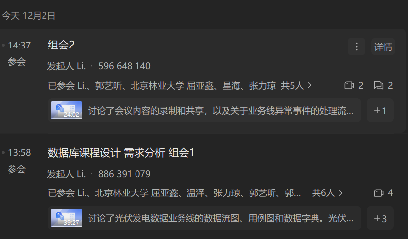

# 数据结构课程设计-第二次组会-会议纪要

**参与人员：** 全体参与
**整理人：** 李天顺 

---
## 1. 主要内容

本次会议以线上会议的方式展开，会议视频留档。会议上，按照各个同学的工作情况依次进行汇报、问题沟通；当前配电、光伏、告警业务已基本完成主要工作，能耗、大屏尚欠进度。

除了沟通问题，本次依据实际情况重新确定了需求分析的ddl，明确了后续的工作进度、方法核流程。

---

## 2. 核心问题与决议

### 2.1 系统异常定义与数据质量
* **问题描述：** 张力琼提出关于“波动超过 20%”的具体含义，以及“数据质量”如何界定的问题。
* **讨论结果：** **组内自行补充、定义一个合理的逻辑（自圆其说）即可**。

### 2.2 图表绘制与格式规范
* **数据流图&用例图：** 根据最终李天顺编写的文档，明确统一的绘制逻辑以及格式。

### 2.3 进度安排与截止时间
* **目标任务：** 完成数据流程图、用例图、数据字典（至少包含数据项目），提早提交，ddl之前提交最终版本。
* **拟定时间：** **十三周-周五24点之前**。

### 2.4 系统管理员职责问题以及绘制问题
* **问题描述：** 郭艺昕提出系统管理员的职责问题如何界、如何绘制
* **讨论结果：** 暂时保持，按照目前方法绘制

### 2.5 运维人员是否要出现在配电、光伏、能耗
* **问题描述：** 不确定运维人员的工作，不确定其是否要绘制到告警之外的业务的数据流图之中
* **讨论结果：** 运维人员需要线下查看具体设备提供的详细异常数据，故保留当前画法

### 2.6 数据字典格式
* **经过讨论、投票，决定使用一张表的格式写明各个业务的所有数据项**

---
## 腾讯会议会议记录

